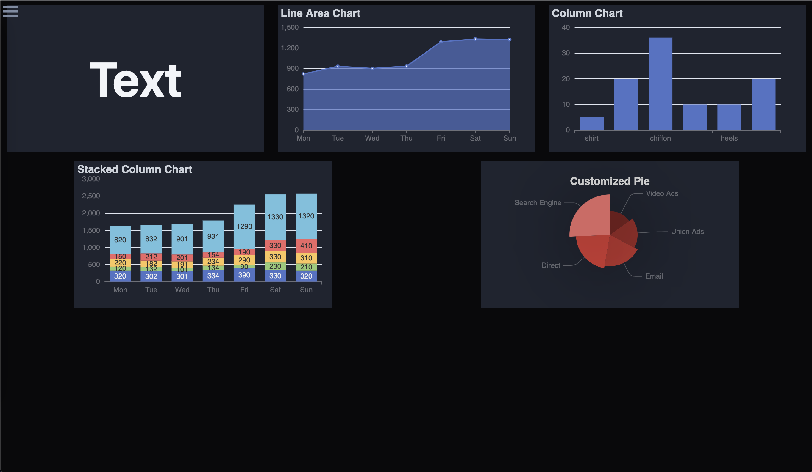
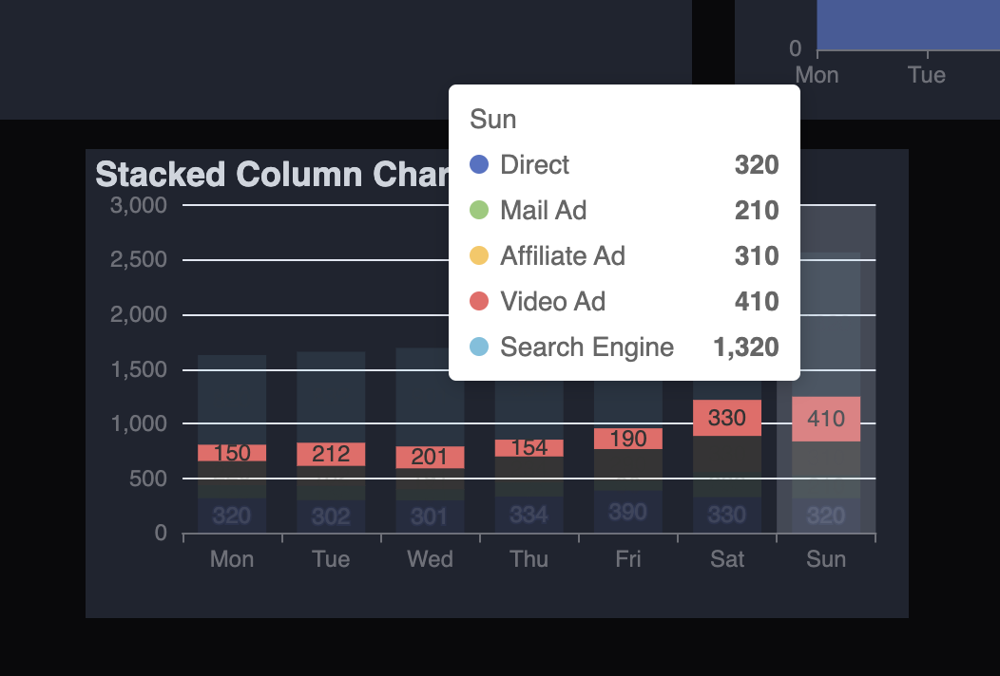
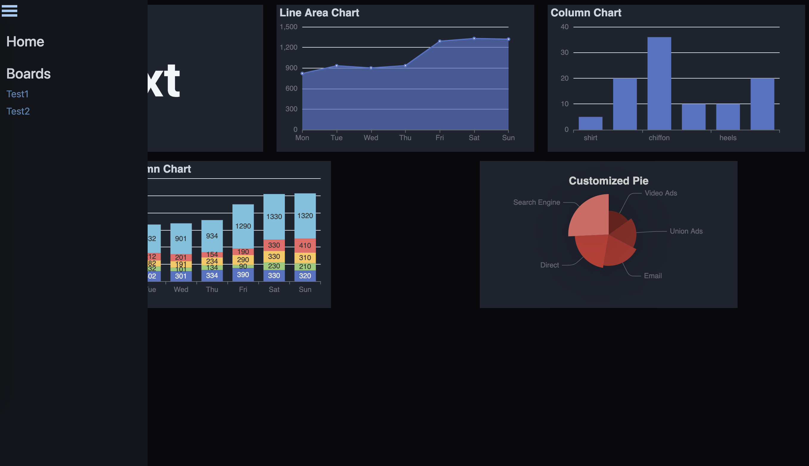

# vue-dashboard

Quick, deployable dashboards. 

**Notes: alpha release, potentially breaking api changes**

SPA that provides front-end visualization based on data received. Flexible enough that you can use it with any server/language such as express.js or flask. 

Write great app code and logic, vue-dashboard is a quick droppable dashboarding layer to visualize data.

### Project Goals
- Quick and easy dashboards for any project
- The final presentation layer

### What it's not
- Data exploration tool
- Self service / no code dashboards
- manage anything non-frontend (i.e. users / passwords / caching)

### Sample Screenshots




### API Structure
The SPA sends 3 API calls. 

**/boards**
This endpoint expects a json object to return an array of board names and the url-slug the router should use to fetch the board resources.
```json
{
    "boards": [
        {"name": "Sample name", "slug": "sample-name"},
        {"name": "Sample name2", "slug": "sample-name2"}
    ]
}
```

**/board/:slug**
This endpoint returns a json object with the board name/slug and an array of board tiles, the chart id is used to query chart data & format.
```json
{
    "name": "Sample Name",
    "slug": "sample-name",
    "tiles": [
        {
            "chartId": "text1"
        },
        {
            "chartId": "c2"
        },
        {
            "chartId": "c2"
        }
    ]
}
```

**/chart/:id**
This endpoint returns a json object with the chart type.
Text tile example:
```json
{
    "type": "text",
    "id": "ex-id",
    "text": "Sample Text"
}
```

[Apache eCharts](https://echarts.apache.org/en/index.html) example
```json
{
    "type": "eChart",
    "id": "ex-id",
    "eChart": {Apache eCharts Option}
}
```